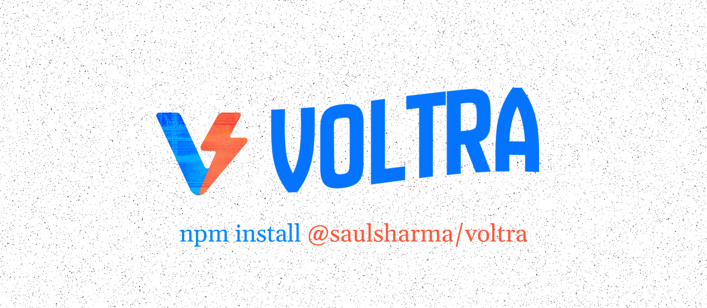

# Voltra

Voltra turns React Native JSX into SwiftUI so you can ship custom Live Activities, Dynamic Island layouts, and widgets without touching Xcode. Author everything in React, keep hot reload, and let the config plugin handle the extension targets.

## Highlights

- Ship Live Activities, Dynamic Island variants, and static widgets directly from React components.
- Works with Expo Dev Client or bare React Native; the config plugin wires iOS extension targets for you.
- Fast iteration: hooks respect Fast Refresh, `devAutoRebind` re-attaches to running Live Activities, and both JS and native layers enforce ActivityKit payload budgets.
- Production-ready push: collect ActivityKit push tokens and push-to-start tokens, stream lifecycle updates, and build server-driven refreshes.
- Familiar styling: mix Tailwind-style `className` utilities, React Native style props, and ordered SwiftUI modifiers in one place.
- Types-first & agent-friendly: the VoltraUI schema, hooks, and examples ship with TypeScript definitions, tests, and docs so AI coding agents stay productive.

> [!NOTE]
> Voltra targets iOS 16.2+ for Live Activities and iOS 17.0+ for the widget extension. Support for additional Apple surfaces will roll out as Apple stabilizes new APIs.

`voltra` is a React Native module for rendering SwiftUI via VoltraUI on iOS. Write UI in React (JSX) → the library converts it to VoltraUI JSON → it renders natively in SwiftUI contexts like Live Activities and Widgets.

## Features

- Author UI in JSX with lightweight primitives (e.g., `VStack`, `Text`, `Button`, `SymbolView`, `LinearGradient`)
- Start, update, and end VoltraUI instances from JS (iOS 16.2+)
- Pass either JSX or JSON; the library normalizes under the hood
- Presentation variants for Dynamic Island (minimal, compact, expanded)
- High-level hooks (`useVoltraWidget`, `useVoltraLiveActivity`) to auto-start and auto-update your surfaces
- Event hook for component interactions (forwarding via App Groups)
- Native SF Symbols support via `SymbolView` with full API parity to expo-symbols (all symbol types, weights, scales, colors, animations)
- Bring your own artwork via `Image source={{ ... }}` (SF Symbols with `systemName`, asset catalog entries, and App Group file URIs are all supported)
- Rich gradient backgrounds with `LinearGradient` (custom start/end points, color stops, dithering)
- Ordered modifiers array for precise SwiftUI modifier ordering via the `modifiers` prop
  - RN-style props map to a rich subset of styles, including granular padding/margins and percentage widths (e.g., `paddingHorizontal`, `marginTop`, `width: '100%'`).
  - Unknown RN styles (e.g., `gap`, percent widths, flexbox props) are ignored in native rendering and log dev warnings
- Vendored VoltraUI Swift sources locally (no external SPM)
- Deep linking for Live Activities and Widgets via a single `deepLinkUrl` option
  - Unlimited static widgets via AppIntents-based configuration (arbitrary IDs)
- Status and metrics: `ProgressView`, `Gauge`, and new `Timer` (countdown/stopwatch) with tint and gauge style support
- Gauges render percentage readouts by default; toggle with `showValueLabel` / `hideValueLabel` for tighter layouts

## Platform compatibility

**Note:** This module is intended for use on **iOS devices only**.

- Live Activities require iOS 16.2+.
- Static widgets are implemented with AppIntents-based configuration, which requires iOS 17.0+ for the widget extension target. The plugin sets the extension deployment target to iOS 17.0.

## Getting Started

> [!NOTE]  
> The library isn't supported in Expo Go, to set it up correctly you need to use [Expo DevClient](https://docs.expo.dev/versions/latest/sdk/dev-client/) .
> To begin using `voltra`, follow the installation and configuration steps outlined below:

### Step 1: Installation

Run the following command to add the voltra module to your project:

```sh
npm install voltra
```

### Step 2: Config Plugin Setup

The module comes with a built-in config plugin that creates the iOS extension target with the necessary files.

1. **Add the config plugin to your app.json or app.config.js:**
   ```json
   {
     "expo": {
       "plugins": ["voltra"]
     }
   }
   ```
   Optional plugin options (subject to change) can be added later as the library evolves.
   ```json
   {
     "expo": {
       "plugins": [
         [
           "voltra",
           {
             "enablePushNotifications": true
           }
         ]
       ]
     }
   }
   ```
2. **Deep linking (URL scheme)**
   Set a URL scheme so taps on Live Activities/Widgets can open your app. You can add this in `app.json`:

   ```json
   {
     "expo": {
       "scheme": "yourappscheme"
     }
   }
   ```

   The config plugin will mirror the scheme to the widget extension. If a scheme is not set, the iOS bundle identifier will be used as a fallback.

3. **Optional: App Groups for event forwarding**
   If you want VoltraUI component events (e.g. Button taps) to reach your JS code while the extension is active, enable App Groups and set a group identifier:

   ```json
   {
     "expo": {
       "plugins": [
         [
           "voltra",
           {
             "groupIdentifier": "group.your.app.voltraui"
           }
         ]
       ]
     }
   }
   ```

   The extension will write events into a shared queue; the app will poll and emit them via `addVoltraUIEventListener`.

4. **Vendored VoltraUI Swift sources (no external SPM):**
   The config plugin copies vendored VoltraUI sources from `ios-files/VoltraUI-main` into the widget target. No external SPM dependency is required.

Then prebuild your app with:

```sh
npx expo prebuild --clean
```

#### Unlimited static widgets (AppIntents)

Voltra registers a single AppIntent-driven widget (“VoltraUI Widget”) that supports unlimited instances. Each pinned widget has an Edit configuration where you set an arbitrary string ID; that ID maps directly to the JSON you write from JS.

Prefer `useVoltraWidget` in your app to keep an ID synchronized. The imperative helpers remain useful for scripts, tests, or one-off admin tools:

```ts
// Write JSON for widget with ID "sales_north"
await startVoltraUI(ui, { target: 'widget', widgetKey: 'sales_north', deepLinkUrl: '/widgets?id=sales_north' })

// Update or clear a specific widget instance using its synthetic id
await updateVoltraUI('widget:sales_north', ui)
await endVoltraUI('widget:sales_north')
```

If no JSON has been set for an ID, the widget renders a small placeholder (“This widget is currently empty”). When you omit `widgetKey`, Voltra targets the default slot `'1'`; pass a descriptive string (e.g., `'sales_north'`) per pinned widget to keep multiple instances in sync.

### Step 3: Usage in Your React Native App

Import the functionalities provided by the `voltra` module in your JavaScript or TypeScript files:

```ts
import {
  useVoltraWidget,
  useVoltraLiveActivity,
  startLiveActivity,
  updateLiveActivity,
  endLiveActivity,
  endAllLiveActivities,
  // Advanced / compatibility
  startVoltraUI,
  updateVoltraUI,
  endVoltraUI,
  addVoltraUIEventListener,
  addActivityTokenListener,
  addActivityPushToStartTokenListener,
  addActivityUpdatesListener,
  // JSX Components
  VStack,
  HStack,
  ZStack,
  Text,
  Button,
  SymbolView,
  LinearGradient,
  Timer,
} from 'voltra'

import type { VoltraUIEvent } from 'voltra'
```

### Widgets: keep content in sync

```tsx
import { useMemo } from 'react'
import { VStack, Text, useVoltraWidget } from 'voltra'

export function SalesWidget() {
  const ui = useMemo(
    () => (
      <VStack
        style={{
          width: 320,
          padding: 20,
          borderRadius: 16,
          backgroundColor: '#ffffff',
          borderWidth: 1,
          borderColor: '#e5e7eb',
        }}
      >
        <Text style={{ fontSize: 24, fontWeight: '700', textAlign: 'center' }}>North Region</Text>
        <Text style={{ fontSize: 16, textAlign: 'center', marginTop: 8 }}>Sales up 12.4% WoW</Text>
      </VStack>
    ),
    []
  )

  useVoltraWidget(ui, {
    widgetKey: 'sales_north',
    deepLinkUrl: '/widgets?id=sales_north',
    autoUpdate: true,
    persistOnUnmount: true,
  })

  return null
}
```

> [!TIP]
> Mount your `useVoltraWidget` hooks in a provider that runs when the app launches. Seeding each widget slot (for example `widget:1`, `widget:2`) before the user adds it keeps the Home Screen from showing placeholder content.

### Live Activities: screen-driven lifecycle

```tsx
import { useMemo } from 'react'
import { VStack, Text, useVoltraLiveActivity } from 'voltra'

export function OrderTracker({ orderId }: { orderId: string }) {
  const ui = useMemo(
    () => (
      <VStack style={{ padding: 16, borderRadius: 14, backgroundColor: '#111827' }}>
        <Text style={{ color: 'white', fontSize: 18, fontWeight: '700' }}>Order #{orderId}</Text>
        <Text style={{ color: '#9CA3AF', marginTop: 6 }}>Driver en route · ETA 12 min</Text>
      </VStack>
    ),
    [orderId]
  )

  const { isActive, start, update, end } = useVoltraLiveActivity(ui, {
    autoStart: true,
    deepLinkUrl: `/orders/${orderId}`,
  })

  // use start/update/end imperatively as needed…
  return null
}
```

## API

The library now exposes high-level helpers for the common widget and Live Activity flows. The underlying VoltraUI primitives remain available for advanced targets or future Apple surfaces.

### High-level (recommended)

- **`useVoltraWidget(ui: VoltraUIInput | VoltraUIInputJSX, options: UseVoltraWidgetOptions)`**  
  Mount inside your component tree (layout/provider) to push widget JSON and keep it in sync. Automatically starts on mount, re-sends updates when your JSX changes, and can persist state across unmounts.

- **`useVoltraLiveActivity(ui: VoltraUIInput | VoltraUIInputJSX, options?: UseVoltraLiveActivityOptions)`**  
  Thin wrapper around the base hook with `target` prefilled to `'liveActivity'`. Use this for screens or services that manage a Live Activity lifecycle.

- **`startLiveActivity(ui: VoltraUIInput | VoltraUIInputJSX, options?: LiveActivityStartOptions): Promise<string>`**  
  Imperative helper to start a Live Activity from event handlers or background jobs. Supports `deepLinkUrl`, `endAllBeforeStart`, `activityId`, and `autoEndAt`.

- **`updateLiveActivity(id: string, ui: VoltraUIInput | VoltraUIInputJSX): Promise<void>`**  
  Pushes an update payload to an existing Live Activity.

- **`endLiveActivity(id: string): Promise<void>`**  
  Ends the specified Live Activity.

### Advanced: VoltraUI low-level API

- **`useVoltraUI(ui: VoltraUIInput | VoltraUIInputJSX, options?: UseVoltraUIOptions)`**  
  Shared hook that powers the helpers above. Reach for it when you need to mix targets, experiment with new Apple extensions, or control lifecycle manually.

- **`startVoltraUI(ui: VoltraUIInput | VoltraUIInputJSX, options?: { target?: 'liveActivity' | 'widget'; endAllBeforeStart?: boolean; deepLinkUrl?: string; widgetKey?: string; activityId?: string }): Promise<string>`**  
  Starts a VoltraUI instance for any supported target. The library normalizes JSX/variants to JSON internally and returns the instance ID.

- **`updateVoltraUI(id: string, ui: VoltraUIInput | VoltraUIInputJSX): Promise<void>`**  
  Updates a running instance with a new payload; JSX or JSON supported.

- **`endVoltraUI(id: string): Promise<void>`**  
  Ends/dismisses the instance.

- **`endAllLiveActivities(): Promise<void>`**  
  Ends all running Live Activities created via this module. Useful to guarantee the next start is the only one the system can present.

- **`endAllVoltraUI(): Promise<void>`**  
  Alias that currently maps to `endAllLiveActivities()`; reserved for multi-target endings in the future.

- **`addVoltraUIEventListener(listener: (event: VoltraUIEvent) => void): EventSubscription`**  
  Subscribes to events emitted by rendered VoltraUI components. Event forwarding uses the shared App Group queue.

### Hook options

`useVoltraUI` powers both `useVoltraWidget` and `useVoltraLiveActivity`. Reach for its options when you need finer control:

- `target`: `'liveActivity' | 'widget'`
- `autoStart`: automatically call `start()` on mount (defaults to `false` for Live Activities, `true` for widgets via the helper).
- `autoUpdate`: whether the hook should push updates whenever your JSX changes (default `true`).
- `endAllBeforeStart`: clear out older VoltraUI instances before starting a new one—handy for Dynamic Island demos.
- `deepLinkUrl`: path or URL to open when the user taps the surface.
- `widgetKey`: string ID used to address a specific static widget instance.
- `devAutoRebind`: when `true`, the hook re-attaches to the most recent Live Activity after Fast Refresh so hot reload keeps working.
- `alwaysUpdateOnRender`: in dev, always push updates even if the JSON payload string is unchanged.
- `autoEndAt`: epoch milliseconds to schedule a best-effort auto-end on device (use push for guaranteed endings).

### Debug helpers

```ts
import { listLiveActivityIds } from 'voltra'

const ids = await listLiveActivityIds()
console.log('Running Live Activities:', ids)
```

### Push tokens and activity updates (background-capable)

When you enable push notifications in the config plugin, the module will:

- Start Live Activities with `pushType = .token` so iOS provides per-activity push tokens.
- Emit ActivityKit state changes and push tokens to JS.
- On iOS 17.2+, emit a push-to-start token to allow your server to start a Live Activity remotely.

Listener APIs:

```ts
import { addActivityTokenListener, addActivityPushToStartTokenListener, addActivityUpdatesListener } from 'voltra'

useEffect(() => {
  const subToken = addActivityTokenListener?.(({ activityID, activityName, activityPushToken }) => {
    // Send token to your server; associate with user/session + activityID
  })
  const subPushStart = addActivityPushToStartTokenListener?.(({ activityPushToStartToken }) => {
    // iOS 17.2+: Send token to your server to enable push-to-start
  })
  const subUpdates = addActivityUpdatesListener?.(({ activityID, activityName, activityState }) => {
    // Observe lifecycle: active | ended | stale | dismissed | pending
  })
  return () => {
    subToken?.remove?.()
    subPushStart?.remove?.()
    subUpdates?.remove?.()
  }
}, [])
```

APNs headers (required):

```
apns-push-type: liveactivity
apns-topic: <your.app.bundle.id>.push-type.liveactivity
```

APNs payloads for our attributes/content-state:

- Attributes type: `VoltraUIAttributes`
- Content state: `{ uiJsonData: <base64-encoded UTF‑8 VoltraUI JSON> }`

Push-to-start (iOS 17.2+):

```json
{
  "aps": {
    "event": "start",
    "timestamp": 1754491435000,
    "attributes-type": "VoltraUIAttributes",
    "attributes": { "name": "VoltraUI" },
    "content-state": {
      "uiJsonData": "<base64-of-utf8-voltraui-json>"
    },
    "alert": { "title": "", "body": "", "sound": "default" }
  }
}
```

Update (iOS 16.2+):

```json
{
  "aps": {
    "event": "update",
    "timestamp": 1754063621319,
    "content-state": {
      "uiJsonData": "<base64-of-utf8-voltraui-json>"
    }
  }
}
```

Notes:

- iOS 16.2+ required for Live Activities; push-to-start requires iOS 17.2+.
- Use a physical device (push tokens commonly don’t work on simulators).
- ActivityKit payload budget is tight (≈4 KB). Base64 adds ~33% overhead. Keep JSON minimal; prefer concise layouts and shallow modifier trees.
- For images, prefetch in the app and write to the App Group; reference filenames in JSON. Configure the plugin with `groupIdentifier` so the app and extension share storage.

### Targets and options

- `options.target`: `'liveActivity' | 'widget'`

  - `'liveActivity'` uses ActivityKit (iOS 16.2+)
  - `'widget'` updates the static WidgetKit widget via App Group storage

- `options.deepLinkUrl`: path or URL used when the user taps your Live Activity or Widget.

- `options.widgetKey`: `string` — for static widgets, select which widget ID to update. This must match the ID you set when editing the widget on the Home Screen.

### VoltraUI JSON Schema

UI is described as an array of components. Types include containers (e.g., `VStack`, `HStack`, `ZStack`, `ScrollView`, …), primitives (`Text`, `Image`, `Label`, `Divider`, `Spacer`), and inputs (`Button`, `Toggle`, `TextField`, `Slider`, `Gauge`, `ProgressView`, …).

Each component may include:

- `identifier`
- `eventHandler`
- `children`
- Styling via either:
  - `orderedModifiers: { name: string; args?: Record<string, any> }[]` (preferred, preserves order and allows duplicates)
  - `modifiers: Record<string, any>` (legacy/minimal compatibility)

See `src/types/VoltraUIJson.ts` for the full schema.

<!-- Legacy activity updates section removed. Instance state change events may be exposed in a future version. -->

## Example Usage

### Advanced: Using JSX directly with `useVoltraUI`

For high-level ergonomics, see the earlier sections on `useVoltraWidget` and `useVoltraLiveActivity`. The example below demonstrates the underlying hook for advanced scenarios.

```tsx
import React from 'react'
import { VStack, Text, Button, SymbolView, LinearGradient, useVoltraUI } from 'voltra'

export default function Demo() {
  const ui = (
    <LinearGradient colors={['#667eea', '#764ba2']} start={{ x: 0, y: 0 }} end={{ x: 1, y: 1 }}>
      <VStack identifier="root" style={{ padding: 16 }}>
        <SymbolView name="sparkles" type="hierarchical" scale="large" tintColor="#FFD700" />
        <Text
          modifiers={[{ name: 'font', args: { size: 16, weight: '600' } }]}
          style={{ color: 'white', opacity: 0.9 }}
        >
          Hello VoltraUI
        </Text>
        <Button title="Tap Me" eventHandlerName="onPress" />
      </VStack>
    </LinearGradient>
  )

  const { isActive, start, update, end } = useVoltraUI(ui, {
    autoStart: false,
    autoUpdate: true,
    endAllBeforeStart: true,
    target: 'liveActivity',
    deepLinkUrl: '/live-activities',
  })

  return (
    // render buttons that call start()/update()/end()
    null
  )
}
```

### Styling and modifiers

Prefer the canonical ordered modifiers array when you need precise SwiftUI modifier order:

```tsx
<Text
  modifiers={[
    { name: 'font', args: { size: 16, weight: '600' } },
    { name: 'foregroundStyle', args: { color: '#4CAF50' } },
    { name: 'opacity', args: { value: 0.9 } },
  ]}
>
  Styled
</Text>
```

### Timer (countdown/stopwatch)

The `Timer` component renders a flexible countdown or stopwatch using SwiftUI’s built-in timer renderers.

```tsx
import { Timer } from 'voltra'

// Digital countdown (00:59, 00:58, ...)
<Timer endAtMs={Date.now() + 60_000} mode="text" style={{ color: '#A7B4D4' }} />

// Circular countdown with accent tint
<Timer endAtMs={Date.now() + 45_000} mode="circular" className="tint-emerald-500" />

// Linear countdown bar (use maxWidth to fill available space)
<Timer endAtMs={Date.now() + 30_000} mode="bar" className="tint-emerald-500" modifiers={[{ name: 'frame', args: { maxWidth: 'infinity' } }]} />

// Stopwatch (count up for 30s)
<Timer durationMs={30_000} direction="up" mode="text" />

// Hide automatically when finished
<Timer endAtMs={Date.now() + 15_000} autoHideOnEnd />
```

### SymbolView (SF Symbols)

The `SymbolView` component provides native SF Symbols rendering with full API parity to expo-symbols:

```tsx
import { SymbolView } from 'voltra'

// Basic monochrome symbol (colors accept named values or hex strings)
<SymbolView name="heart.fill" tintColor="#FF6B6B" />

// Hierarchical symbol with scale and weight
<SymbolView
  name="wifi"
  type="hierarchical"
  scale="large"
  weight="semibold"
  tintColor="#4CAF50"
/>

// Palette symbol with multiple colors
<SymbolView
  name="person.crop.circle.fill"
  type="palette"
  colors={['#FF6B6B', '#4ECDC4', '#45B7D1']}
  scale="medium"
/>

// Multicolor symbol with animation
<SymbolView
  name="heart.fill"
  type="multicolor"
  size={32}
  animationSpec={{
    effect: { type: 'bounce' },
    repeating: true
  }}
/>
```

`SymbolView` automatically applies your provided `style.width` / `style.height` (or the `size` prop) and translates color strings to SwiftUI, so the rendered symbol matches what you preview in React Native. When `animationSpec` is set, the Live Activity mirrors Expo’s bounce / pulse / scale / variable color symbol effects on iOS 17+.

### LinearGradient

The `LinearGradient` component renders gradient backgrounds behind its children:

```tsx
import { LinearGradient, VStack, Text } from 'voltra'

// Basic gradient
<LinearGradient colors={['#667eea', '#764ba2']}>
  <Text style={{ color: 'white' }}>Gradient Background</Text>
</LinearGradient>

// Custom start/end points (diagonal)
<LinearGradient
  colors={['#FF6B6B', '#4ECDC4', '#45B7D1']}
  start={{ x: 0, y: 0 }}
  end={{ x: 1, y: 1 }}
  locations={[0, 0.5, 1]}
  dither={true}
>
  <VStack style={{ padding: 16 }}>
    <Text style={{ fontWeight: '600', color: 'white' }}>Beautiful Gradient</Text>
    <Text style={{ opacity: 0.9, color: 'white' }}>With custom stops</Text>
  </VStack>
</LinearGradient>
```

### Image sources

The `Image` component mirrors the familiar React Native API. Use `source` for artwork, `systemName` for SwiftUI-style glyphs, or `assetName` when the asset lives inside the extension bundle.

```tsx
import { Image, VStack } from 'voltra'

function ArtworkPreview() {
  return (
    <VStack style={{ gap: 12 }}>
      {/* Artwork written into the App Group container */}
      <Image
        source={{ uri: 'app-group://album-art.png' }}
        style={{ width: 120, height: 120, borderRadius: 16 }}
        modifiers={[{ name: 'clipped', args: { enabled: true } }]}
      />

      {/* SwiftUI-style shorthand for SF Symbols */}
      <Image systemName="music.quarternote.3" style={{ color: '#F472B6', fontSize: 28 }} />
    </VStack>
  )
}
```

> [!IMPORTANT]
> Live Activities and widgets cannot fetch remote assets on their own. Prefetch any network images inside your app, copy them into the shared App Group directory, and reference them with `source={{ uri: 'app-group://filename.png' }}` before starting or updating the Activity.

Tip:

- To auto-dismiss the Live Activity when the countdown ends, pass `autoEndAt` to `useVoltraLiveActivity` (or `startLiveActivity`) with the same timestamp as your `Timer`.

RN-style props map to a minimal, explicit subset for convenience:

- `style.color` → `foregroundStyle`
- `style.backgroundColor` → `backgroundStyle`
- `style.opacity` → `opacity`
- `style.fontWeight` → `fontWeight`
- `style.fontStyle: 'italic'` → `italic`
- `style.padding*` (e.g., `padding`, `paddingHorizontal`, `paddingTop`) → `padding` modifier
- `style.margin*` (e.g., `margin`, `marginHorizontal`, `marginTop`) → `padding` modifier (margins are implemented as padding in SwiftUI)
- `style.fontSize` → `font.size`
- `style.width`/`style.height` (numbers) → `frame.width`/`frame.height`
- `style.width: '100%'` → `maxWidth: .infinity`
- `style.borderRadius` → `cornerRadius.radius`
- `style.tintColor` → `tint` (control accent color, e.g., `ProgressView` bar)
- `style.gaugeStyle` → `gaugeStyle` (e.g., `accessoryCircular`, `accessoryLinear`, `linearCapacity`, `automatic`)

Tailwind-like tokens:

- `tint-<color>` → `style.tintColor`
- `gauge-<style>` → `style.gaugeStyle`

Example:

### Liquid Glass (iOS 26+)

On devices running iOS 26+ and when building with the corresponding Xcode SDK, you can enable Apple’s new Liquid Glass effect from JSX via the ordered modifiers API:

```tsx
<VStack modifiers={[{ name: 'glassEffect', args: { shape: 'roundedRect', cornerRadius: 12 } }]} style={{ padding: 12 }}>
  <Text>Liquid Glass Card</Text>
  <Text style={{ opacity: 0.8 }}>Shimmering, lensing edges.</Text>
  {/* More children... */}
</VStack>
```

Notes:

- Requires building your app and extension against the iOS 26 SDK. The code path is gated at runtime, but the Swift symbol `.glassEffect` itself only exists on iOS 26 SDKs.
- Supported args today: `shape` (`'rect' | 'roundedRect' | 'capsule' | 'circle'`) and `cornerRadius` (for rect/roundedRect). Additional options like `style`, `tint`, and `interactive` may be exposed as Apple stabilizes the API.
- Legacy dictionary form is also accepted for compatibility; if you must avoid ordered modifiers you can use `style={{ modifiers: { glassEffect: true, glassShape: 'capsule' } }}` but ordered modifiers are preferred.

Unsupported RN styles (e.g., `gap`, flexbox layout props) are ignored by native rendering and will log a dev warning in development.

### Presentation variants for Dynamic Island

You can provide distinct JSX for minimal/compact/expanded modes. The widget selects the appropriate region JSON and applies sensible fallbacks.

```tsx
const variants = {
  lockScreen: (
    <VStack identifier="card" style={{ padding: 12 }}>
      <Text>Now Playing</Text>
    </VStack>
  ),
  island: {
    expanded: <Text>Center content</Text>,
    compact: <Image imageURL="music.note" />,
    minimal: <Image imageURL="music.note" />,
  },
}

// Works both with the high-level hook and the low-level start/update helpers
const { start } = useVoltraLiveActivity(variants, { endAllBeforeStart: true })
```

Fallback rules in the iOS widget:

- Lock screen defaults to `island.expanded` if `lockScreen` is omitted.
- Compact/minimal fall back to `minimal` → `compact` → `expanded` → `lockScreen`.
- Reusing the same JSX element across regions (e.g., the same `base` card for `lockScreen` and `island.expanded`) is efficient: the normalizer detects duplicates and keeps only one copy.

Payload safety: If a payload exceeds the safety budget (~3.6 KB for JSON), the library throws on JS and native. There is no automatic trimming.

### Events

`addVoltraUIEventListener` lets you subscribe to component events (e.g., button taps). When the plugin is configured with an App Group (`groupIdentifier`), the widget/extension writes events to a shared queue and the app polls and emits them to JS. You will also see diagnostic events like `voltraui_onAppear` and `voltraui_decode_error`.

> [!NOTE]
> Receiving push token may not work on simulators. Make sure to use physical device when testing this functionality.

#### Identifiers

- The JSX→JSON converter automatically assigns a deterministic identifier (e.g., `auto_Text_0.1`) to each component when you don’t provide one.
- This enables event correlation out of the box without forcing authors to pass `identifier` props.
- Identifiers are stable as long as the component structure and ordering remain the same. If you insert/remove siblings, downstream indices change and auto IDs for subsequent nodes change.
- If you need absolute stability for a specific element regardless of structure changes, pass an explicit `identifier` prop for that element.

## Notes

- iOS-only, iOS 16.2+ required for Live Activities API used to start/update/end instances.
- Use an Expo Dev Client (not Expo Go) for native modules.
- The config plugin provisions the iOS extension target and copies vendored VoltraUI Swift sources locally (no external SPM).
- Payload safety: JS enforces a conservative JSON budget for Live Activities (~3.6 KB JSON vs ActivityKit’s 4 KB hard cap). Widgets don’t have that budget.

### Troubleshooting: Seeing old content in the Dynamic Island

If you still see older text after starting a new VoltraUI instance, you likely have multiple Live Activities running. iOS can present any one of them. Use `endAllLiveActivities()` before starting a new instance (or the “End All” button in the example app) to ensure the new content is the one shown.

## Roadmap

- Richer component event payloads and interaction metadata.
- Helpers for multi-widget synchronization and background refresh orchestration.
- Expanded component catalog and SwiftUI modifier coverage as Apple surfaces evolve.

## Limitations

- External images: Voltra does not yet download remote assets for you. Prefetch files into the configured App Group (documented above) and reference the filenames from JSON.
